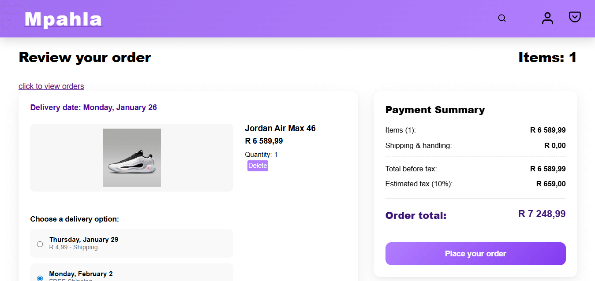
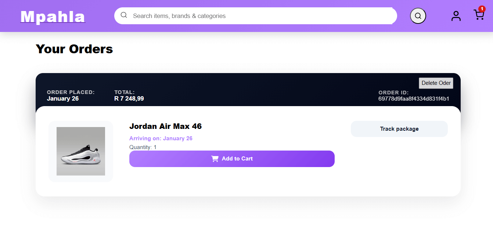
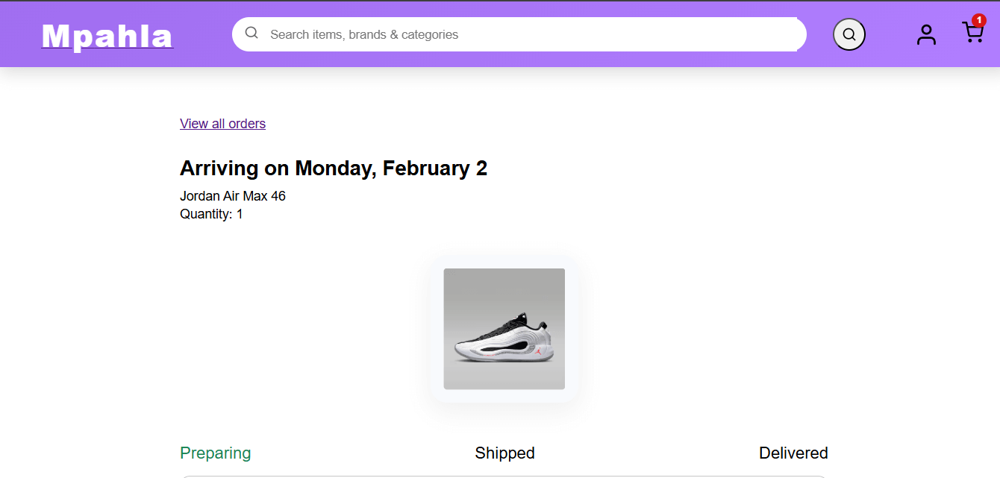
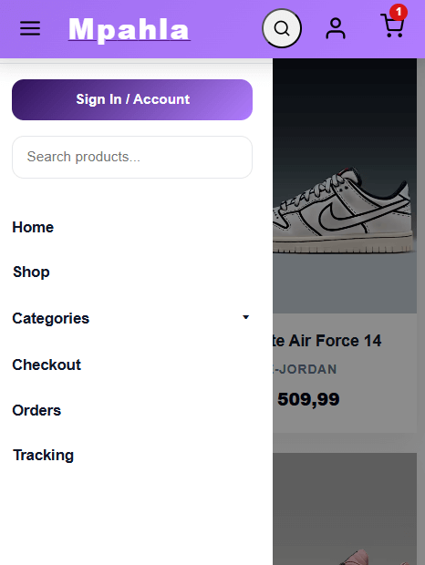
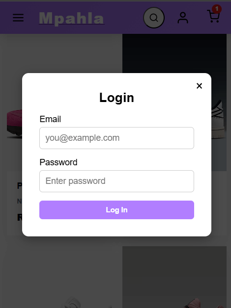

# E-Commerce Frontend

A modern, responsive e-commerce frontend built with **React** and **Vite**.  
The application provides a smooth shopping experience with authentication, cart management, and order tracking.

## 🚀 Features

- Responsive UI for desktop and mobile devices
- User authentication (login & signup)
- Product listing and product details
- Add/remove items from cart
- Checkout flow and order placement
- Order tracking interface
- Fast development and build performance using Vite

## 🛠️ Tech Stack

- React
- Vite
- JavaScript (ES6+)
- SCSS / CSS 
- REST API integration

VIEW SCREENSHOTS

Landing Page

.png)

Home Page

Checkout Page

Order Page

Tracking Page

Mobile

.png)
